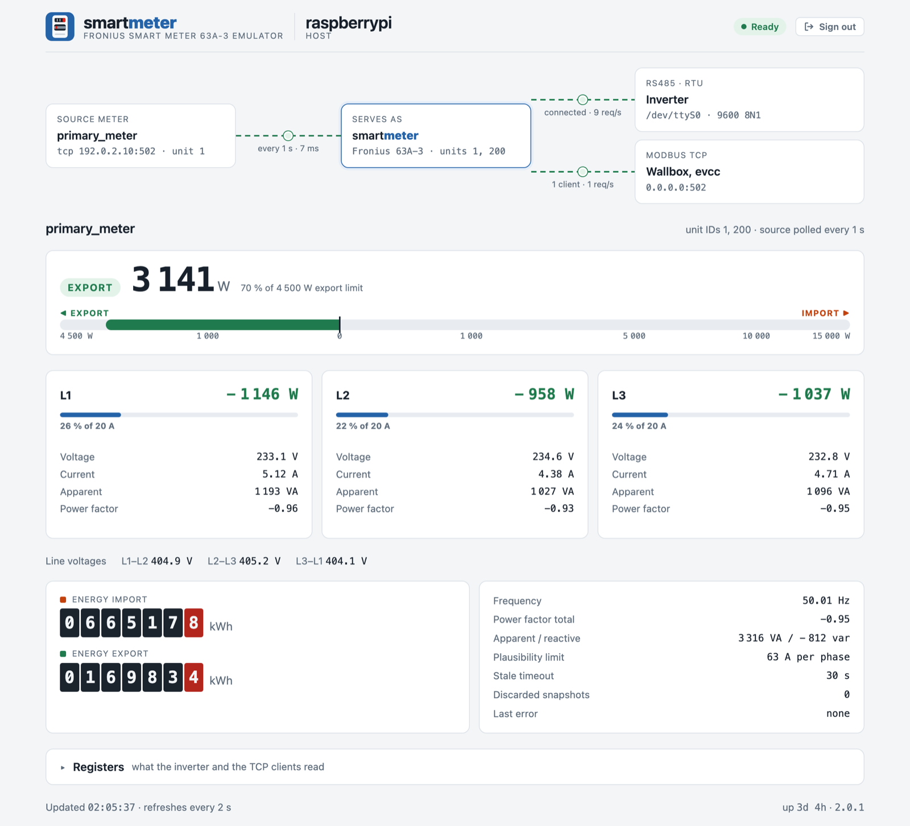

#  smartmeter

**Turn any Modbus energy meter into a Fronius Smart Meter — for the inverter on RS485 and for wallboxes on TCP.**

[](https://github.com/womat/smartmeter/actions/workflows/ci.yml)
[](https://github.com/womat/smartmeter/releases/latest)
[](LICENSE)
[](go.mod)


🇩🇪 [Deutsche Kurzfassung](README.de.md)

A Fronius inverter only accepts a Fronius Smart Meter at its meter input. If the grid connection is
already measured by another device — a Smartfox, an energy manager, any meter with a Modbus
interface — smartmeter reads that device and **answers as a Fronius Smart Meter 63A-3**:

- on **RS485 (Modbus RTU)**, unit ID 1, with the proprietary register map the inverter polls,
- on **Modbus TCP**, unit ID 200, with the **SunSpec** meter block (model 203) that wallboxes,
  [evcc](https://evcc.io) and other Fronius-compatible clients read.

One upstream meter is polled once per interval and served on every unit ID and both transports at
the same time, so all clients see the same values from the same moment.

<picture>
  <source media="(prefers-color-scheme: dark)" srcset="docs/images/web-ui-dark.png">
  
</picture>

*The built-in [web page](#web-page) (sample values).*

---

## Features

- **Fronius Smart Meter emulation**: proprietary RS485 map (4096 ff.) and SunSpec block (40000 ff.)
- **Any Modbus TCP or RTU meter as source**: registers, data types, byte/word order and scaling are
  configured per field; fixed values and expressions (`{power_l1} + {power_l2}`) are supported
- **Derived values**: line-to-line voltages, apparent/reactive power, total PF and per-phase energy
  are computed when the source does not provide them
- **Several unit IDs per meter** and several meters per instance
- **Spike filter**: implausible readings (beyond what a meter of the configured rated current can
  measure) are discarded, the last valid values stay in place
- **Source failure is visible to the inverter**: without valid values for `staleTimeout` (30 s) the
  unit IDs stop answering, so the inverter sees a failed meter instead of frozen values; they
  never answer before the first valid values
- **Block reads**: neighbouring registers are fetched with one request
- **Consistent reads**: a client never sees a 32-bit value half updated
- **Robust RS485**: a failed serial port (e.g. an unplugged USB adapter) is reopened
  automatically, and `/ready` reports it meanwhile
- **Web page** with energy flow, power, phases, counters and the served registers, embedded in the
  binary and usable offline
- **HTTPS REST API** with API key, IP allowlist / blocklist, readiness probe
- **Hot reload** of the configuration via `SIGHUP`; a broken file is refused, the emulation goes on
- Release builds for every Raspberry Pi architecture, from the **Pi Zero (ARMv6)** to 64-bit systems

---

## Quick start

**1. Download** the archive for your Pi from the [latest release](https://github.com/womat/smartmeter/releases/latest):

| Archive        | Raspberry Pi model                           |
|----------------|----------------------------------------------|
| `linux_armv6`  | Pi 1 and Zero (1st gen)                      |
| `linux_armv7`  | Pi 2 / 3 / 4 / 5 / Zero 2 W with a 32-bit OS |
| `linux_arm64`  | Pi 3 / 4 / 5 / Zero 2 W with a 64-bit OS     |

```sh
VERSION=2.0.0 ARCH=armv6        # see the release page for the latest version
BASE=https://github.com/womat/smartmeter/releases/download/v$VERSION
curl -LO $BASE/smartmeter_${VERSION}_linux_$ARCH.tar.gz -LO $BASE/checksums.txt
sha256sum -c checksums.txt --ignore-missing
tar xzf smartmeter_${VERSION}_linux_$ARCH.tar.gz
```

**2. Install** binary, example configuration and a certificate. The service user needs the
`dialout` group for the serial port:

```sh
sudo groupadd -r -f smartmeter
sudo useradd -r -s /usr/sbin/nologin -g smartmeter smartmeter
sudo usermod -aG dialout smartmeter
sudo mkdir -p /opt/smartmeter/{bin,etc}

sudo install -m 755 smartmeter /opt/smartmeter/bin/
sudo install -m 640 config/config.yaml /opt/smartmeter/etc/
sudo openssl req -x509 -nodes -newkey rsa:2048 -days 825 \
  -keyout /opt/smartmeter/etc/key.pem -out /opt/smartmeter/etc/cert.pem -subj "/CN=$(hostname)"
sudo chown -R smartmeter:smartmeter /opt/smartmeter
```

**3. Configure** `/opt/smartmeter/etc/config.yaml`: set `env: prod`, a random `apiKey`
(`openssl rand -hex 24`), the serial port of the RS485 adapter and the address of your upstream
meter — see [Configuration](#configuration).

**4. Start** it as a service:

```sh
sudo tee /etc/systemd/system/smartmeter.service > /dev/null <<'EOF'
[Unit]
Description=smartmeter — Fronius Smart Meter emulator
After=network-online.target
Wants=network-online.target

[Service]
User=smartmeter
Group=smartmeter
Type=simple
ExecStart=/opt/smartmeter/bin/smartmeter
ExecReload=/bin/kill -HUP $MAINPID
Restart=on-failure
RestartSec=5
# Binding port 502 (Modbus TCP) needs this capability as a non-root user.
AmbientCapabilities=CAP_NET_BIND_SERVICE

[Install]
WantedBy=multi-user.target
EOF

sudo systemctl daemon-reload
sudo systemctl enable --now smartmeter
journalctl -u smartmeter -n 20      # "Module started successfully"
```

To keep the API key out of the config file, write `apiKey: ${SMARTMETER_API_KEY}` and add
`Environment=SMARTMETER_API_KEY=...` (or an `EnvironmentFile=`) to the `[Service]` section.

**5. Check** that the values are current: `curl -k https://<your-pi>:8443/ready` answers
`{"status":"ready"}`, and the inverter's web interface shows the meter.

---

## Wiring

```
 upstream meter ──(Modbus TCP or RTU)──► Raspberry Pi ──(RS485, Modbus RTU)──► Fronius inverter
                                              │
                                              └──(Modbus TCP, port 502)──► wallbox / evcc
```

- Connect an RS485 adapter (UART HAT on `/dev/ttyS0`, or USB on `/dev/ttyUSB0`) to the meter input
  of the inverter: **D+ to D+, D− to D−, GND to GND**. Terminate the bus with 120 Ω at both ends.
- Configure the inverter for a **Fronius Smart Meter** on Modbus RTU, address 1, 9600 baud, 8N1 —
  the defaults of a real meter and of `listen.rtu`.
- Only one meter may answer on the bus at address 1: remove or readdress a real Fronius meter.
- On a Raspberry Pi, use `/dev/ttyS0` (the UART on the GPIO header, enable it with `enable_uart=1`
  and without a serial console) and keep `interFrameDelay: 20ms` from the example configuration.

---

## Configuration

The configuration file is a YAML file, by default `/opt/smartmeter/etc/config.yaml`. Unknown keys are
an error, so a misspelled key cannot silently fall back to its default. Environment variables are
expanded in the `${VAR}` form only. Durations are Go duration strings (`300ms`, `1s`).

The example configures a [Smartfox Pro](https://smartfox.at) as upstream meter:

```yaml
# =============================================================================
# smartmeter configuration
# =============================================================================
#
# smartmeter reads an upstream meter (Modbus TCP or RTU) and serves its values
# as a Fronius Smart Meter 63A-3:
#   - the proprietary RS485 map (4096 ff.) polled by Fronius inverters, and
#   - the SunSpec block (40000 ff., model 203) read by wallboxes, evcc, etc.
# The Fronius target registers are fixed in the code; this file only says where
# the values come from and on which unit IDs the emulated meter answers.

# logLevel defines the minimum log level.
# Messages with at least this level are logged.
# Allowed values: debug | info | warn | error
logLevel: info

# logDestination defines where logs are written to.
# Supported values: stdout | stderr | /path/to/logfile
logDestination: stdout

# environment: dev | prod
# With prod, a missing webserver.certFile is an error; dev falls back to the embedded,
# publicly known development certificate.
env: dev


# =============================================================================
# Webserver configuration (HTTPS)
# =============================================================================
webserver:
  # Host address the HTTPS server listens on (0.0.0.0 = all interfaces)
  listenHost: 0.0.0.0

  # Port the HTTPS server listens on
  listenPort: 8443

  # Global API key for protected endpoints
  # Can be taken from the environment, e.g. apiKey: ${SMARTMETER_API_KEY}
  apiKey: changeme!

  # TLS private key file
  keyFile: /opt/smartmeter/etc/key.pem

  # TLS certificate file
  certFile: /opt/smartmeter/etc/cert.pem

  # Blocked IP addresses or networks (empty = none blocked)
  # Examples: 192.168.0.1, 192.168.0.0/16, 10.0.0.0/8
  blockedIPs: [ ]
  #  - 192.168.0.1
  #  - 192.168.0.0/16

  # Allowed IP addresses or networks (empty = all allowed)
  # Note: ::1 is the IPv6 loopback address
  # Examples: 127.0.0.1, ::1, 192.168.0.0/16
  allowedIPs: [ ]
  #  - 127.0.0.1
  #  - ::1
  #  - 192.168.0.0/16

# =============================================================================
# Modbus server (facing the inverter and other clients)
# =============================================================================
# TCP and RTU can be active at the same time; both serve every unit ID of every meter.
listen:
  tcp:
    enabled: true
    host: 0.0.0.0
    port: 502

  # RS485 to the Fronius inverter (the inverter polls unit ID 1 at 9600 8N1)
  rtu:
    enabled: true
    port: /dev/ttyS0
    baudRate: 9600
    dataBits: 8
    parity: N              # N | E | O
    stopBits: 1
    # Silence that ends a request (default: t3.5 of the Modbus specification, ~4ms at
    # 9600 baud). Raise it when requests arrive split ("Error parsing RTU frame", CRC
    # errors in the log): USB adapters need 20ms-40ms, and so does the UART of a
    # Raspberry Pi (/dev/ttyS0), which split about one request per minute with the
    # default and none with 20ms.
    interFrameDelay: 20ms

# =============================================================================
# Emulated meters, keyed by name
# =============================================================================
# unitIDs      - Unit IDs the meter answers on (1-247, unique across all meters).
#                All IDs serve the same values. Fronius convention:
#                1 = inverter via RS485, 200 = SunSpec meter via TCP.
# maxCurrent   - Rated current per phase in A (Fronius Smart Meter 63A-3: 63).
#                A poll cycle is discarded as a spike, keeping the last valid values, if
#                  |current per phase| > maxCurrent * 1.2
#                  |power per phase|   > 253 V * maxCurrent * 1.2   (63 A: ~19 kW)
#                  |total power|       > 3 * the limit per phase    (63 A: ~57 kW)
#                0 or unset = no check.
# staleTimeout - Go duration (default 30s). Without a valid snapshot from the source for this
#                long, the unit IDs stop answering (RTU silent, TCP exception 11): the
#                inverter then sees a failed meter instead of acting on frozen values. The next
#                valid snapshot brings them back. 0s = keep answering with the last values.
#                The unit IDs never answer before the first valid snapshot.
# limits       - Limits of the installation; they only scale the web page.
#   importPower  - W drawn from the grid at most (default 3 * 230 V * current)
#   exportPower  - W fed into the grid at most, e.g. the inverter's export limit
#                  (default 3 * 230 V * current)
#   current      - A per phase, e.g. the main fuse (default maxCurrent, else 63)
#
# source       - Upstream meter
#   type       - tcp | rtu
#   unitID     - Unit ID of the upstream meter
#   timeout    - Request timeout as Go duration string (default 2s)
#   tcp        - host, port (default 502)
#   rtu        - port, baudRate, dataBits, parity, stopBits (default 9600 8N1)
#
# poll         - Reading the upstream meter
#   interval     - Poll interval as Go duration string (default 1s)
#   maxBlockGap  - Unused registers read along to merge fields into one request (default 4)
#   maxBlockSize - Registers per request, at most 125 (default 125)
#
# map          - Canonical field -> source. Required for a Fronius meter:
#                  power_total, power_l1..3 [W], voltage_l1..3 [V], current_l1..3 [A],
#                  energy_import, energy_export [Wh], frequency [Hz]
#                Optional: pf_l1..3 (default 1), voltage_l1_l2/l2_l3/l3_l1 [V]
#                  (default phase voltage * sqrt(3)), device_id, firmware, serial_number,
#                  serial_str. Everything else (apparent/reactive power, PF total, ...) is derived.
#   type: register - address (0-based), dtype (uint16 | uint32 | uint64 | int16 | int32 |
#                    int64 | float32), byteOrder, wordOrder (big | little, default big),
#                    scale (value = (raw + offset) * 10^scale), offset
#   type: fixed    - value
#   type: expr     - expr, e.g. "{power_l1} + {power_l2} + {power_l3}"; operators + - * /,
#                    parentheses, SQRT(), ABS(). Write {field}, not ${field}: ${...} is
#                    replaced by an environment variable when the file is loaded.
# =============================================================================
meter:
  # Smartfox Pro as upstream meter, served to a Fronius inverter (RS485) and wallbox/evcc (TCP).
  # Register list (1-based in the document, 0-based here):
  # https://smartfox.at/wp-content/uploads/2022/12/Modbus-Register-SMARTFOX-Pro-SMARTFOX-Pro-2-v22e-00.01.03.10.xlsx
  primary_meter:
    unitIDs: [ 1, 200 ]
    maxCurrent: 63
    staleTimeout: 30s
    limits:
      importPower: 15000
      exportPower: 4500
      current: 20

    source:
      type: tcp
      unitID: 1
      timeout: 300ms
      tcp:
        host: smartfox.local
        port: 502

    poll:
      interval: 1s
      maxBlockGap: 10      # one request for 40999-41037 (39 registers)
      maxBlockSize: 125

    map:
      # Identification as expected by the inverter (registers 18, 768, 4176)
      device_id:
        type: fixed
        value: 285
      firmware:
        type: fixed
        value: 117
      serial_number:
        type: fixed
        value: 99999999

      energy_import:       # Wh
        type: register
        address: 40999
        dtype: uint64
      energy_export:       # Wh
        type: register
        address: 41003
        dtype: uint64

      power_total:         # W
        type: register
        address: 41017
        dtype: int32
      power_l1:
        type: register
        address: 41019
        dtype: int32
      power_l2:
        type: register
        address: 41021
        dtype: int32
      power_l3:
        type: register
        address: 41023
        dtype: int32

      voltage_l1:          # 0.1 V
        type: register
        address: 41025
        dtype: uint16
        scale: -1
      voltage_l2:
        type: register
        address: 41026
        dtype: uint16
        scale: -1
      voltage_l3:
        type: register
        address: 41027
        dtype: uint16
        scale: -1

      current_l1:          # mA
        type: register
        address: 41028
        dtype: uint32
        scale: -3
      current_l2:
        type: register
        address: 41030
        dtype: uint32
        scale: -3
      current_l3:
        type: register
        address: 41032
        dtype: uint32
        scale: -3

      pf_l1:               # 0.0001
        type: register
        address: 41034
        dtype: int16
        scale: -4
      pf_l2:
        type: register
        address: 41035
        dtype: int16
        scale: -4
      pf_l3:
        type: register
        address: 41036
        dtype: int16
        scale: -4

      frequency:           # 0.01 Hz
        type: register
        address: 41037
        dtype: uint16
        scale: -2
```

### Unit IDs

Every meter answers on all of its `unitIDs`, on TCP and RTU. The values are the same; only the
SunSpec Modbus address (register 40068) reports the unit ID that was asked. Fronius uses unit ID 1
on RS485 (inverter) and 200 for the meter over TCP, so `unitIDs: [1, 200]` serves both.

### Spike filter

With `maxCurrent` set, a poll cycle whose current or power exceeds what a meter of that rated current
can measure is discarded as a whole, keeping the last valid values. The limits allow for the upper
grid voltage tolerance (253 V) and a 20 % short overload:

| Value             | Limit                         | 63 A    |
|-------------------|-------------------------------|---------|
| current per phase | maxCurrent × 1.2              | 75.6 A  |
| power per phase   | 253 V × maxCurrent × 1.2      | ≈ 19 kW |
| total power       | 3 × the limit per phase       | ≈ 57 kW |

A discarded cycle is logged as `Implausible Modbus snapshot discarded` and counted in `/health`.

### Source failure

The unit IDs do not answer before the first valid values from the source, so a client never reads
empty registers (an inverter would take them as 0 W). When the source stops delivering valid values,
the last ones are served on; after `staleTimeout` (default 30 s) the unit IDs stop answering: silence
over RTU, exception 11 over TCP. The inverter then sees a failed meter and falls back to its own
settings, e.g. the export limit, instead of acting on frozen values. The next valid values bring the
unit IDs back, with no moment of empty registers. Both steps are logged (`unit IDs no longer answer`,
`unit IDs answer`). `staleTimeout: 0s` keeps answering with the last values.

---

## Register maps

The target registers are fixed in the code ([`pkg/fronius/registers.go`](pkg/fronius/registers.go))
and served on every unit ID. Addresses are 0-based, as sent on the wire; 32-bit values are high word
first.

### Proprietary RS485 map (Fronius inverter)

Fronius does not publish this map. It was recorded in 2020 by listening to the RS485 traffic between
a Fronius inverter and a real Fronius Smart Meter 63A-3, and is partly confirmed by the
[LoxWiki](https://loxwiki.atlassian.net/wiki/spaces/LOX/pages/1536590351). It is served exactly as
recorded; registers not listed stay 0. The Smart Meter TS 65A-3 uses a different map.

| Register       | Value                      | Type   | Unit       |
|----------------|----------------------------|--------|------------|
| 18             | device type (285)          | uint16 |            |
| 768            | firmware (117)             | uint16 |            |
| 4096/4098/4100 | voltage L1/L2/L3–N         | uint32 | mV         |
| 4102/4104/4106 | current L1/L2/L3           | uint32 | mA         |
| 4110/4112/4114 | voltage L1-L2/L2-L3/L3-L1  | uint32 | mV         |
| 4116           | active power total         | int32  | 0.01 W     |
| 4124           | energy import              | uint32 | Wh         |
| 4128           | energy export              | uint32 | Wh         |
| 4132           | power factor total         | int16  | 0.01       |
| 4134           | frequency                  | uint16 | 0.1 Hz     |
| 4140/4142/4144 | active power L1/L2/L3      | int32  | 0.01 W     |
| 4164/4165/4166 | power factor L1/L2/L3      | int16  | 0.01       |
| 4176           | serial number              | uint32 |            |

Positive power is import from the grid, negative power is export.

### SunSpec meter (wallbox, evcc)

Specified by the [SunSpec Alliance](https://sunspec.org) (common model 1, meter model 203 with
integer and scale factors) and by Fronius in `Smart_Meter_Register_Map_Int&SF.xlsx`
([gen24-modbus-api-external-docs.zip](https://www.fronius.com/en/~/downloads/Solar%20Energy/Operating%20Instructions/gen24-modbus-api-external-docs.zip)).
The documents count from 1: register 40001 there is address 40000 here.

| Address       | Content                                                    |
|---------------|------------------------------------------------------------|
| 40000         | `SunS` marker                                              |
| 40002–40068   | common model 1: `Fronius`, `Smart Meter 63A`, serial number, Modbus address (unit ID) |
| 40069–40175   | meter model 203: current, voltage, frequency, power, apparent/reactive power, PF, energy |
| 40176–40177   | end block (`0xFFFF`, 0)                                    |

---

## REST API

| Method | Path                | Auth    | Description                                                     |
|--------|---------------------|---------|-----------------------------------------------------------------|
| GET    | `/`                 | —       | Web page; it asks for the API key and reads the endpoints below  |
| GET    | `/version`          | —       | Application name and version                                    |
| GET    | `/ready`            | —       | Readiness probe: 200, or 503 while a meter has delivered no valid values for three poll intervals or the RTU port is not available |
| GET    | `/health`           | API Key | Runtime metrics, every meter with its served values, the Modbus listeners |
| GET    | `/registers?unit=N` | API Key | Both register maps of unit ID N as a client reads them          |

Authentication via the `X-API-Key` header. Errors are returned as `{"error": "..."}` with the HTTP
status.

```sh
curl -k https://localhost:8443/version
curl -k https://localhost:8443/ready
curl -k -H "X-API-Key: your-api-key" https://localhost:8443/health
curl -k -H "X-API-Key: your-api-key" "https://localhost:8443/registers?unit=1"
```

`/health` reports, besides the runtime metrics, per meter, the state of the RTU port and the Modbus
listeners with the requests they answered since start:

```json
"meters": {
  "primary_meter": {
    "unitIDs": [1, 200],
    "source": "tcp 192.168.1.10:502 unit 1",
    "ready": true,
    "online": true,
    "lastSuccess": "2026-10-08T22:16:52+02:00",
    "ageSeconds": 0.4,
    "latencyMs": 12.1,
    "polls": 3600,
    "lastError": "power_total = 1.048576e+06 exceeds limit 57380.4",
    "lastErrorTime": "2026-10-08T21:03:11+02:00",
    "discardedSnapshots": 1,
    "pollIntervalSeconds": 1,
    "staleTimeoutSeconds": 30,
    "maxCurrent": 63,
    "limits": { "importPower": 15000, "exportPower": 4500, "current": 20 },
    "values": { "power_total": -7, "power_l1": 110, "voltage_l1": 230.2, "energy_import": 66517823, "...": 0 }
  }
},
"rtu": [
  { "port": "/dev/ttyS0", "connected": true, "since": "2026-10-08T22:16:51+02:00" }
],
"modbus": {
  "tcp": { "address": "0.0.0.0:502", "requests": 3612, "clients": 1 },
  "rtu": { "port": "/dev/ttyS0", "line": "9600 8N1", "requests": 32410 }
}
```

`online` is false before the first valid values and after `staleTimeout`; `offlineSince` then says
since when. `/registers` returns every entry of the proprietary map and the SunSpec block with
address, canonical field (empty for a fixed value), type, scale factor, raw words and decoded value,
taken from one consistent copy.

### Web page

`https://<your-pi>:8443/` shows the state at a glance and refreshes every 2 seconds:

- **Energy flow**: source meter → smartmeter → inverter (RS485) and TCP clients. A line turns red
  when a link fails; its LED flashes once per poll of the source or per request of a client.
- **Power** with direction (import/export) on a bar from the export to the import limit, the three
  **phases** with current against the fuse, the **energy counters** and details such as frequency,
  power factor, discarded readings and the last error.
- **Registers** (fold-out): what the inverter and the TCP clients read, per unit ID.
- The logo turns like the disc of a Ferraris meter: forward on import, backward on export, faster
  with more power, still while the values are frozen.

The page is part of the binary and loads nothing from the internet. It asks for the API key once and
keeps it in the browser (`localStorage`). The bars are scaled by `limits` in the meter configuration.

---

## Command-line Flags

| Flag        | Default                           | Description                                                         |
|-------------|-----------------------------------|---------------------------------------------------------------------|
| `--config`  | `/opt/smartmeter/etc/config.yaml` | Path to the configuration file                                      |
| `--debug`   | `false`                           | Enable debug logging to stdout (overrides log settings from config) |
| `--version` | `false`                           | Print the application version and exit                              |
| `--about`   | `false`                           | Print application details and exit                                  |
| `--help`    | `false`                           | Print this help message and exit                                    |

The config file path can also be set via the environment variable `CONFIG_FILE`.

```bash
smartmeter --config /etc/smartmeter/config.yaml
smartmeter --debug
CONFIG_FILE=/etc/smartmeter/config.yaml smartmeter
```

---

## TLS Certificate

> **Warning — always configure a real certificate.** With `env: prod` a missing `certFile` stops
> the start. With `env: dev` the server instead falls back to a self-signed certificate compiled
> into the binary and only logs a warning. That certificate's private key ships inside every
> published release archive, so it is public knowledge. It exists solely so a fresh checkout starts
> up during development.

```sh
openssl req -x509 -nodes -newkey rsa:2048 \
  -keyout /opt/smartmeter/etc/key.pem \
  -out /opt/smartmeter/etc/cert.pem \
  -days 825 -subj "/CN=$(hostname)"
```

---

## Hot-Reload

Send `SIGHUP` to reload the configuration without restarting the process. The Modbus server and the
polling are stopped and started again with the new settings.

The new configuration is loaded and validated **before** anything is torn down. If it fails, the
reload is refused with `Config reload rejected, keeping the running configuration` and the service
keeps running. If the new settings only fail on start (TLS certificate missing, port 502 or the
serial port in use, upstream meter unreachable), `Start with the new configuration failed, continuing
with the previous one` is logged and the previous settings are used again.

```sh
sudo systemctl reload smartmeter       # requires ExecReload in the unit, see Quick start
```

---

## Troubleshooting

**The inverter shows no meter**
Check `/ready` first. If it is ready, the problem is on the RS485 side: wiring (D+/D− swapped is
the most common fault), termination, a second device answering on address 1, or the inverter not set
to a Fronius Smart Meter on Modbus RTU. `Error parsing RTU frame` (CRC errors) in the log means
requests arrive split: set `listen.rtu.interFrameDelay`, e.g. to `20ms`. USB adapters need it, and
so does the UART of a Raspberry Pi (`/dev/ttyS0`): with the default t3.5 (~4 ms at 9600 baud) about
one request per minute arrived in two pieces, with `20ms` none. The inverter retries a lost request,
so the meter keeps working, but the log fills with warnings.
`--debug` logs every poll of the upstream meter.

**`Serial port failed` in the log**
The serial port went away, e.g. a USB adapter was unplugged. smartmeter reopens it every 5 seconds
and logs `Serial port reopened` once it is back; meanwhile `/ready` answers 503 and `rtu` in
`/health` shows the error.

**`/ready` answers 503**
The upstream meter has not delivered valid values for three poll intervals. `lastError` in
`/health` and `Modbus poll failed` in the log give the reason, typically a timeout or a wrong
address. `Implausible Modbus snapshot discarded` means the source delivered values beyond the
[spike filter](#spike-filter); check `maxCurrent` and the scaling of the power fields.

**Service is `dead` immediately after start**
A configuration error: the reason is printed on stdout. `Failed to load config file` names a key
that does not exist (often a renamed one, e.g. `devices` → `meter`, `unitIds` → `unitIDs`) or a
duration without unit; `config validation failed` names the invalid value. `bind: permission denied`
for port 502 means `AmbientCapabilities=CAP_NET_BIND_SERVICE` is missing in the unit.

---

## Releases

Every release on the [releases page](https://github.com/womat/smartmeter/releases) carries archives
for all Raspberry Pi architectures with the binary, `config/config.yaml`, `README.md` and `LICENSE`,
plus a `checksums.txt` and a changelog. Versions follow [semantic versioning](https://semver.org/);
a breaking change of the API or the configuration raises the major version.

`smartmeter --version` reports the release a binary was built from. A local build reports something
like `2.0.0-3-g0c13781-dirty` instead.

Building from source needs Go and `make`: clone the repository and run `make help` for the targets.

---

## Disclaimer

smartmeter is an independent project and is not affiliated with, endorsed or supported by
Fronius International GmbH. "Fronius" and product names are used only to describe compatibility.

The inverter controls with the values it reads from the meter — for example a dynamic feed-in
limitation or battery charging. Wrong values (a misconfigured `map`, a wrong scale or sign) lead
to wrong control decisions. Verify the readings against the upstream meter and the inverter's web
interface before relying on them, especially where a grid operator requires a feed-in limit.
The software is provided as is, without warranty (see [`LICENSE`](LICENSE)).

---

## License

smartmeter is released under the MIT License - see [`LICENSE`](LICENSE) for the full text.

### Third-party licenses

The source tree contains no third-party code, but a **compiled binary statically links** the
modules below. Their terms apply to anyone distributing that binary, not to the sources here.

| Module                                   | License            |
|------------------------------------------|--------------------|
| `github.com/simonvetter/modbus`          | MIT                |
| `github.com/womat/mbserver`              | MIT                |
| `go.bug.st/serial`                       | BSD-3-Clause       |
| `github.com/creack/goselect`             | MIT                |
| `github.com/goburrow/serial`             | MIT                |
| `github.com/womat/golib`                 | MIT                |
| `github.com/swaggo/swag`, `http-swagger` | MIT (swagger builds only) |
| `github.com/golang-jwt/jwt/v5`           | MIT                |
| `gopkg.in/yaml.v3`                       | MIT and Apache-2.0 |
| `golang.org/x/sys`                       | BSD-3-Clause       |
